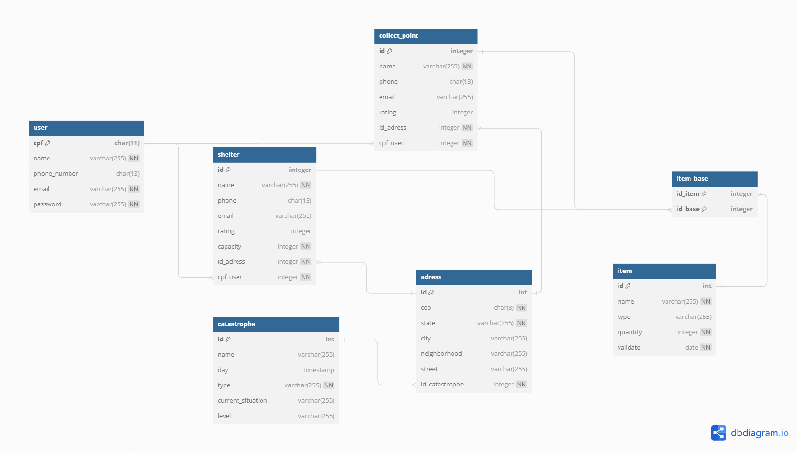

# Rede Solidária

## Objetivo

O banco de dados serve para gerenciar a coleta, organização e distribuição de doações para vítimas de catástrofes. Ele armazena informações sobre usuários (doadores, administradores e abrigos), doações, itens doados e necessidades dos abrigos. Cada tabela tem campos específicos para garantir o rastreamento e a gestão eficiente das doações. Através do banco de dados, é possível monitorar as necessidades em tempo real, otimizar a distribuição de recursos e garantir que os itens cheguem rapidamente a quem precisa, mantendo a segurança e a transparência das operações.

---

## Diagrama Lógico

## Diagrama Conceitual

## Licença

Este projeto está licenciado sob a Licença MIT. Veja o arquivo LICENSE para mais detalhes.

